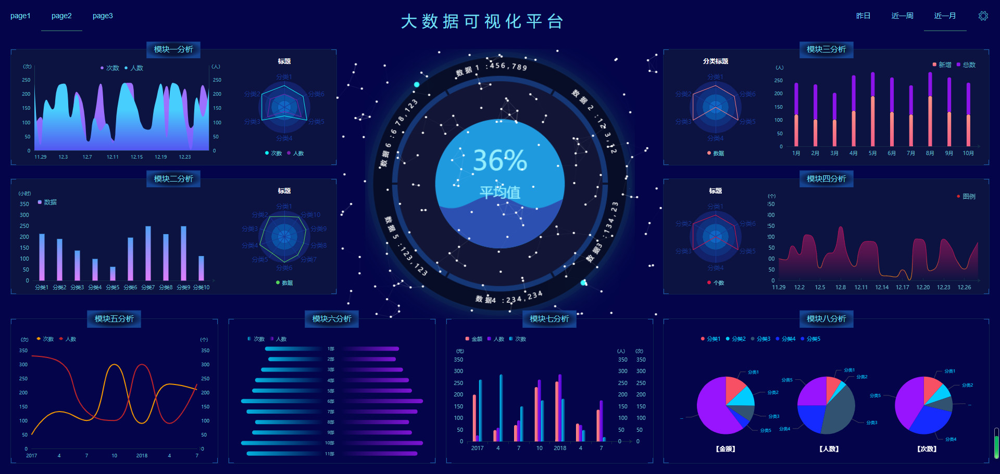
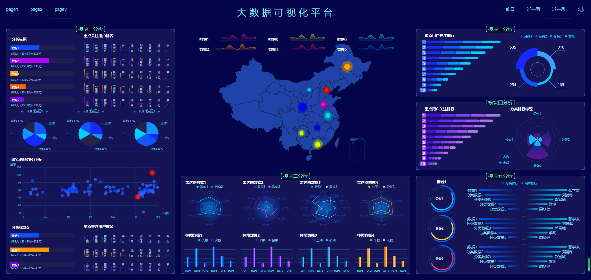

# vue-echarts

> A Vue.js project
数据可视化
## 项目预览地址
https://bym110.github.io/vue-echarts/preview
## Build Setup

``` bash
# install dependencies
npm install

# serve with hot reload at localhost:8080
npm run serve

# build for production with minification
npm run build

# build for production and view the bundle analyzer report
npm run build --report
```
## 三个大屏模板 样式还是比较全的 包括世界地图、中国地图、canvas转盘等
### page1 

### page2 

### page3 

For a detailed explanation on how things work, check out the [guide](http://vuejs-templates.github.io/webpack/) and [docs for vue-loader](http://vuejs.github.io/vue-loader).
